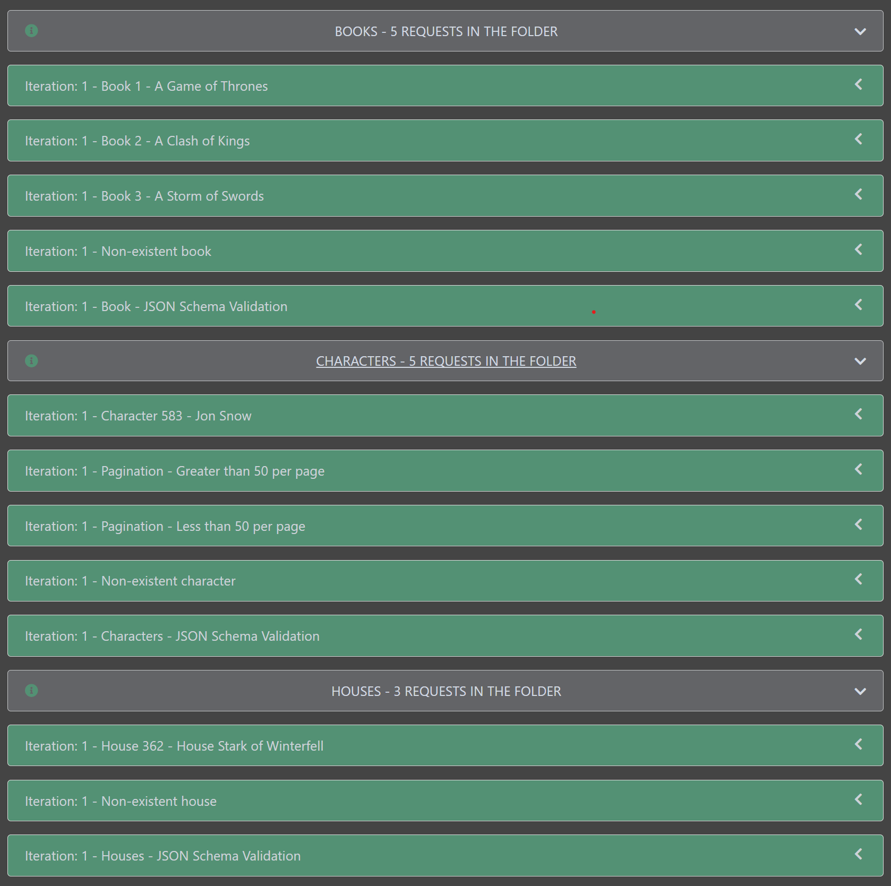
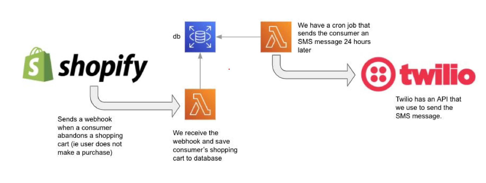

# Project to Demo API Tests for Proxima AI
### Task 1:
1. All the tests are in the postman folder in the Proxima_AI_Quiz.postman_collection.json file.
2. There is a circleci config yml in the .circleci folder that runs the tests on a new commit/merge.
3. We can also add a rate limiting test using the newman --iteration-count parameter set to 20000 which is the request limit per day for anapioficeandfire but I have no way of unblocking myself after so it is just mentioned here.

To run the collection via newman locally and or generate a report run the following commands from a terminal:
> npm i  
> npm run test  
> npm run report

  
  

### Task 2:
  

There are a few unknowns and considerations that need to be made for this scenario. First I do not have all the context for this scenario since I have never run this test manually (which is usually what I would do for any new test before autoamting it) so some of the things that I say may be completely unviable. Here are some of the assumptions that I made:
1. We have an APi that lets us simulate that a user has abandoned the shopping cart (an API available outside the shopify service in lower environments).
2. We can use the API in assumption 1 to save the cart data to the database and retrieve it or another API that does this.
3. We also have an API that is sending the triggering request to the cron job (probably the same one in 1, it's also fine if it's different).
4. We can create a webhook or email hook to send the SMS from twilio as an email.

Manual Test:
1. Trigger a abandoned shopping cart request.
2. Connect to the database service and check if the cart has been saved.
3. Write a SQL query to make sure the cron job would receive the trigger.
4. Set the cron job to trigger in a few seconds rather than 24 hours and verify that it triggers correctly.
5. Check the associated phone to see if the SMS has been recevied and verify the details are correct.

Automated Test: If we have all the means mentioned in the assumptions then we can formulate a automated test case as follows using Cypress/Playwright:
1. Start the test when we receive the response that a shopping cart has been abandoned. In Cypress we can use cy.request() in Playwright we use request.post() or request.get() to test APIs.
2. Verify that the cart data is saved to the database. It is probably best to use a APi approach here, because it is not guaranteed that we will be able to query the database directly in upper environments. But if we can KNEX would be a good tool to use here.
3. Verify that the cart data can be retrieved from the database for our cron job to trigger.
4. Simulate the passing of time via a wait and wait out th time for the cron job to trigger.
5. Send the SMS as an email.
6. Use Gmail API to parse the SMS message.
7. Validate the SMS message details.