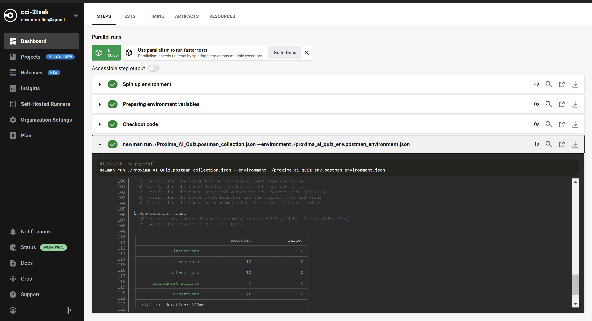
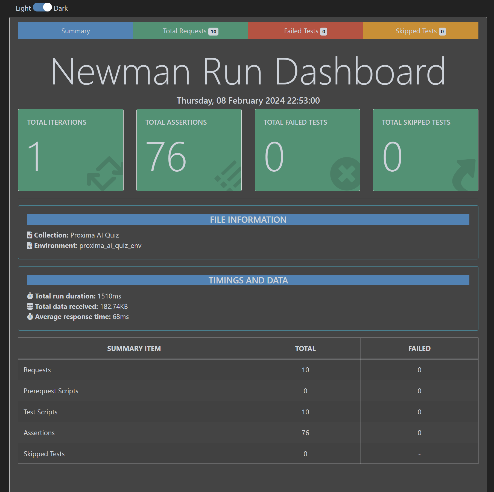

# Project to Demo API Tests for Proxima AI
### Task 1:
1. All the tests are in the postman folder in the Proxima_AI_Quiz.postman_collection.json file.
2. There is a circleci config yml in the .circleci folder that runs the tests on a new commit/merge.

To run the collection via newman locally and or generate a report run the following commands from a terminal:
> npm i  
> npm run test  
> npm run report

  

### Task 2:
